📥 Spam Email Detector

An intelligent Spam Detection System developed using Machine Learning and Python. The project uses the Multinomial Naive Bayes algorithm with CountVectorizer for real-time spam message classification through an interactive Tkinter-based graphical user interface.

🚀 Features
Spam and Ham Message Detection
Tkinter Graphical User Interface (GUI)
Dark Mode Toggle
Voice Output Accessibility
Graphical Result Visualization
Email Validation
Automated CSV History Log Storage
Phishing Detection
Online URL Verification using VirusTotal
Real-Time Message Classification
Live Digital Clock
Detection History
Dashboard with Performance Metrics

🧠 Machine Learning
CountVectorizer
Multinomial Naive Bayes
Scikit-learn

🛠️ Technologies Used

Python
Tkinter
Scikit-learn
Pandas
Matplotlib
pyttsx3
VirusTotal API

📊 Project Performance

Accuracy: 98.48%
Precision: 97.83%
Recall: 90.60%
F1 Score: 94.08%

📁 Project Structure

Spam Detector/
├── main.py

├── config.py

├── dataset.py

├── model.py

├── history.py

├── graph.py

├── dashboard.py

├── phishing.py

├── url_checker.py

├── SMSSpamCollection

├── history.csv

├── requirements.txt

├── .gitignore

├── author.jpg

└── README.md

📦 Required Libraries

Install the required libraries using:
pip install -r requirements.txt
Main libraries:
pandas
scikit-learn
matplotlib
pyttsx3
python-dotenv
requests

▶️ How to Run

Download or clone this repository.
Install the required libraries:
pip install -r requirements.txt
Create a .env file and add your VirusTotal API key:
VIRUSTOTAL_API_KEY=your_api_key_here
Run the application:
python main.py

📜 History

The application stores detection history in history.csv, including message result, phishing information, URL, and online URL verification details.

🔐 Security

The VirusTotal API key is stored in .env and should not be uploaded to GitHub. The .env file is excluded using .gitignore.

👨‍💻 Author

**Anurag Sharma**
Computer Science & Engineering Student
Developed this project as a Machine Learning based Spam Detection System.

📸 Screenshots
### 🖥️ Main GUI
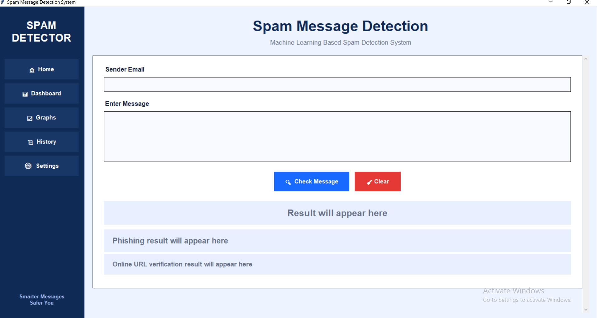

### 📊 Dashboard
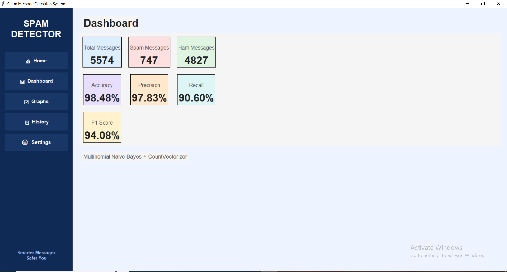

### 📊 Dataset
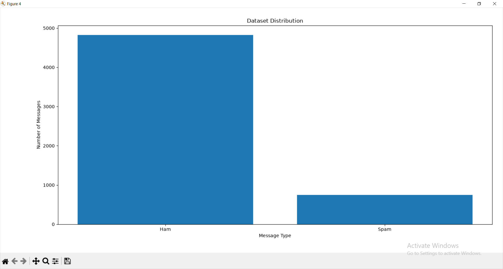

### 📈 Graph
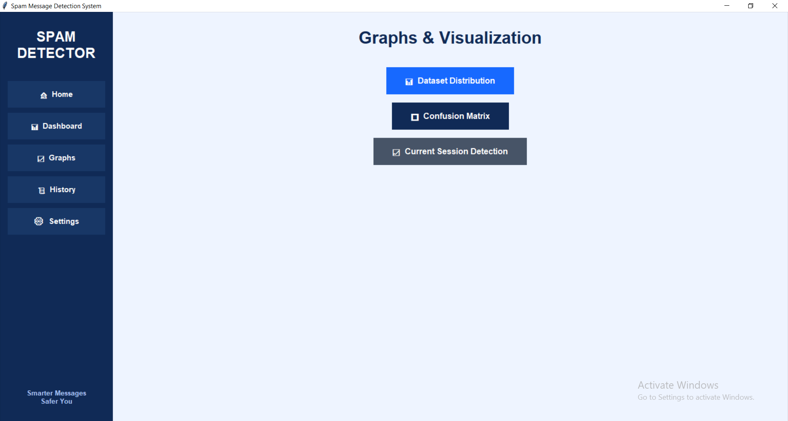

### 🗂️ History
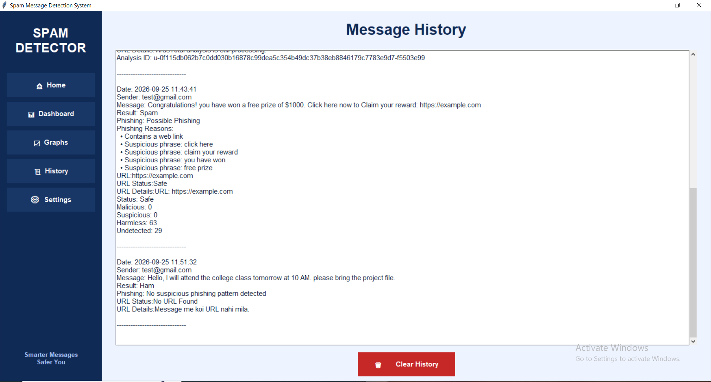

### ⚙️ Settings
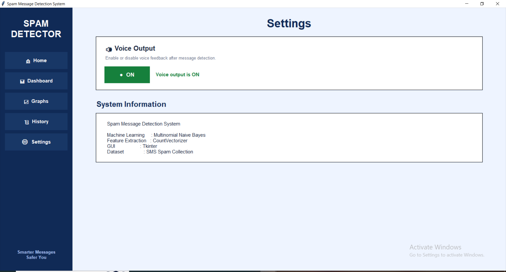

### ⚠️ Spam Detection
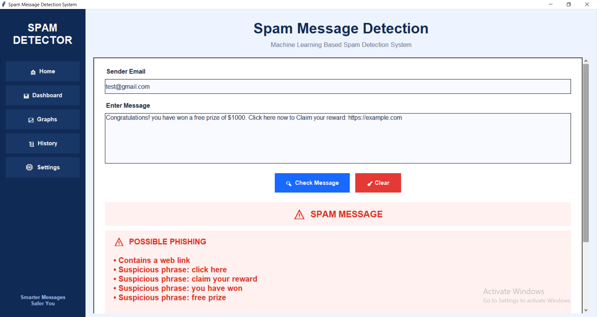

### 🛡️ Ham Detection
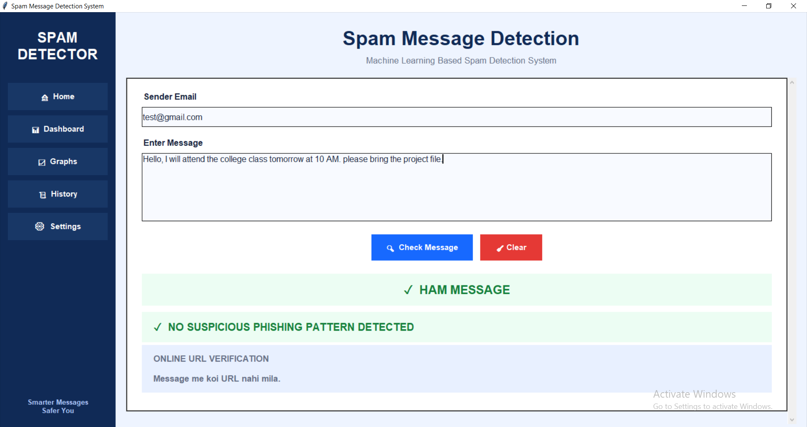

### 🔗 Online URL Verification
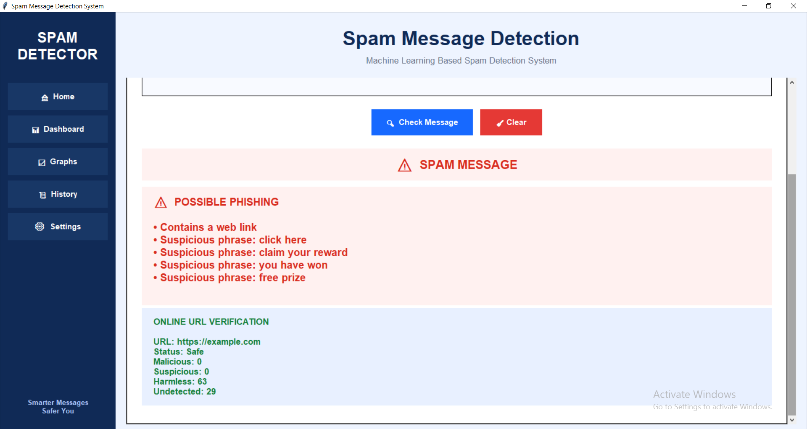

### 📊 Confusion Matrix
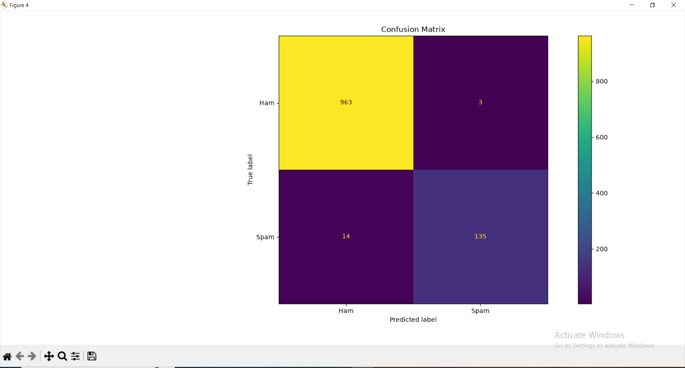

### 📊 CSD
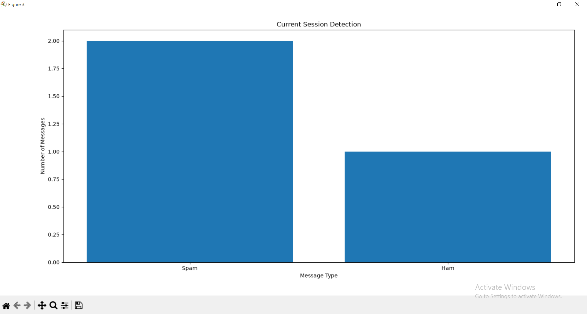

